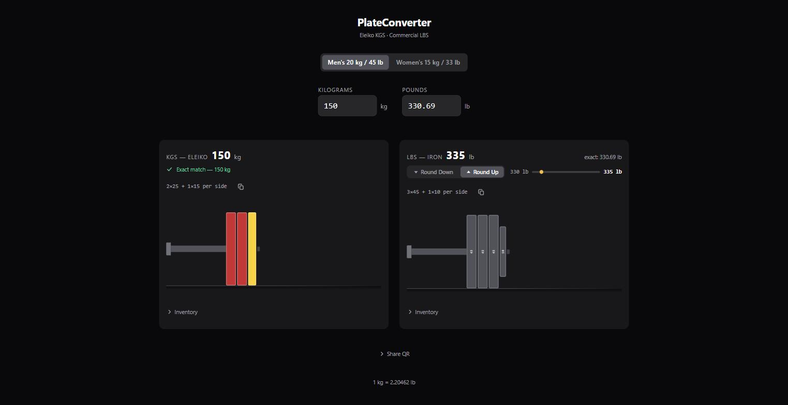

# PlateConverter

A barbell plate loading visualizer for lifters who train in both metric (Eleiko KGS) and commercial imperial (LBS) gyms.

Enter a target weight in either unit and instantly see the exact plate configuration for both standards, side by side.



## Features

- Synced KGS / LBS inputs — editing one updates the other; arrow keys step ±0.5 kg / ±2.5 lb
- Eleiko color-coded bumper and change plates (IWF standard)
- Commercial iron plates with weight labels, standing on a shelf so the loaded bar reads as one object
- Men's (20 kg / 45 lb) and Women's (15 kg / 33 lb) bar selector — shared across both panels
- Plates rendered individually on the bar sleeve (no count abbreviations)
- Round Down / Round Up toggle with a visual bounds track for non-exact weights
- Per-side inventory toggles — disable plates you don't have; choices persist across visits
- Inventory presets — save named plate sets ("Home gym", "Competition") and restore them in one click
- Shareable deep links — `?kg=150&bar=womens&kgp=25,20,15` loads that exact weight, bar, and inventory on arrival
- QR code sharing — show a scannable code for the current configuration to a training partner
- Phone-friendly — artwork scales down on small screens, a decimal keypad opens on the weight fields, and a compact bar keeps both totals on screen while scrolling
- Accessible — labelled inputs, 44px touch targets, visible keyboard focus rings, 4.5:1 text contrast, and state signalled by shape as well as colour

---

## Project Structure

```
src/
  utils/
    constants.ts          # Plate inventories, bar weights, kg plate colors, dimensions
    conversion.ts         # kg <-> lb math, rounding helpers
    loading.ts            # Greedy plate algorithm + bounds (round-down / round-up)
  components/
    Plate.tsx             # Single plate visual (Eleiko or Iron)
    Sleeve.tsx            # Half-barbell sleeve — expands PlateCount into individual plates
    BarSelector.tsx       # Men's / Women's shared bar toggle
    WeightInput.tsx       # Synced numeric input (kg or lb) with arrow-key stepping
    InfoPanel.tsx         # Achievable weight, exact value, round-down/up toggle, breakdown
    BoundsTrack.tsx       # Visual range track showing where exact falls between bounds
    InventoryToggles.tsx  # Collapsible per-side plate enable/disable
    InventoryPresets.tsx  # Save / apply / delete named plate sets (localStorage)
    QrShare.tsx           # QR code of the current deep-link URL
    icons.tsx             # Inline SVG icon set (chevron, caret, copy, check, close)
  test/
    conversion.test.ts
    loading.test.ts
    Plate.test.tsx
    Sleeve.test.tsx
    BarSelector.test.tsx
    WeightInput.test.tsx
    BoundsTrack.test.tsx
    InfoPanel.test.tsx
    InventoryToggles.test.tsx
    InventoryPresets.test.tsx
    QrShare.test.tsx
    icons.test.tsx
    document.test.ts      # index.html meta tags + page background
    App.test.tsx
  App.tsx
  main.tsx
  index.css               # Tailwind entry, page background, --plate-scale, .focus-ring
```

Plate, bar and accent colours live as Tailwind tokens in `tailwind.config.js`
(`bar-*`, `plate-*`, `accent-*`); the Eleiko kg plate colours stay in
`constants.ts` because they follow the IWF colour standard.

---

## Running Locally

**Prerequisites:** Node.js 18+

```bash
# Install dependencies
npm install

# Start dev server (http://localhost:5173)
npm run dev

# Type-check
npx tsc -b --noEmit

# Run tests
npm test

# Run tests with coverage
npm run test:coverage

# Production build
npm run build

# Preview production build locally
npm run preview
```

---

## Deploying on Render

1. Push your repository to GitHub.
2. Go to [render.com](https://render.com) and create a **New Static Site**.
3. Connect your GitHub repository.
4. Set the following:

| Setting | Value |
|---|---|
| **Build Command** | `npm install && npm run build` |
| **Publish Directory** | `dist` |

5. Click **Create Static Site**. Render will build and deploy automatically on every push to `main`.

> No environment variables are required — this is a fully client-side app.

---

## Tech Stack

- [React 19](https://react.dev) + [TypeScript](https://www.typescriptlang.org)
- [Vite](https://vite.dev) — build tool
- [Tailwind CSS v3](https://tailwindcss.com) — styling
- [qrcode](https://github.com/soldair/node-qrcode) — QR generation for share links
- [Vitest](https://vitest.dev) + [React Testing Library](https://testing-library.com) — tests
